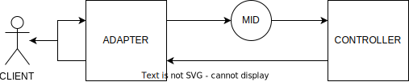

# backAPI


[](https://badge.fury.io/js/backapi)
[](https://img.shields.io/npm/dt/backapi.svg)

A simple API framework using Flexible Persistence

```js
const pool = new Pool(
((DBHandler.getReadHandler() as ServiceHandler)
    .persistence as SequelizeDB).getPersistenceInfo()
);
await Utils.init(pool);
const obj = {};
obj['test'] = 'test';
const handler = DBHandler.getHandler();
const controller = new TestController(DBHandler.getInit());

await ((DBHandler.getReadHandler() as ServiceHandler)
    .persistence as SequelizeDB)
    .getSequelize()
    .models.Test.sync({ force: true });
await handler.getWrite().clear('events');

const sentTest = new Test();
const sentTest2 = new Test();

const store = await controller.store(
    ({
    body: sentTest,
    } as unknown) as Request,
    (mockResponse as unknown) as Response
);
console.log('store:', store);
```



- Adapter. Adapts the data to controller and from the controller. Adapting to the selected protocol (like rest or websocket).
- Mid (Middlewares). Middleware is a function that is called before the controller is called. It's possible to use more than one middleware.
- Controller. Controller is what is called when the request is sent to the server. And is responsible for handling the request. It is also responsible for sending the response. As well as formatting the returned response and return codes if needed.

## Quick Start:
```bash
$ npx tmplr judahh/templateAPI
```

## Adapters

- [REST](https://github.com/Judahh/backAPIRest)
- [Socket](https://github.com/Judahh/backAPISocket)

## Installation

This is a [Node.js](https://nodejs.org/en/) module available through the
[npm registry](https://www.npmjs.com/).

Before installing,
[download and install Node.js](https://nodejs.org/en/download/).

If this is a brand new project, make sure to create a `package.json` first with
the [`npm init` command](https://docs.npmjs.com/creating-a-package-json-file) or
[`yarn init` command](https://classic.yarnpkg.com/en/docs/cli/init/).

Installation is done using the
[`npm install` command](https://docs.npmjs.com/getting-started/installing-npm-packages-locally)
or [`yarn add` command](https://classic.yarnpkg.com/en/docs/cli/add):

```bash
$ npm install backAPI
```

or

```bash
$ yarn add backAPI
```

## Tests

To run the test suite, first install Docker and dependencies, then run
`docker-compose up -d` and `npm test`:

```bash
$ docker-compose up -d
$ npm install
$ npm test
```

or

```bash
$ docker-compose up -d
$ yarn
$ yarn test
```

## People

The original author of backAPI is [Judah Lima](https://github.com/Judahh)

[List of all contributors](https://github.com/Judahh/backAPI/graphs/contributors)
